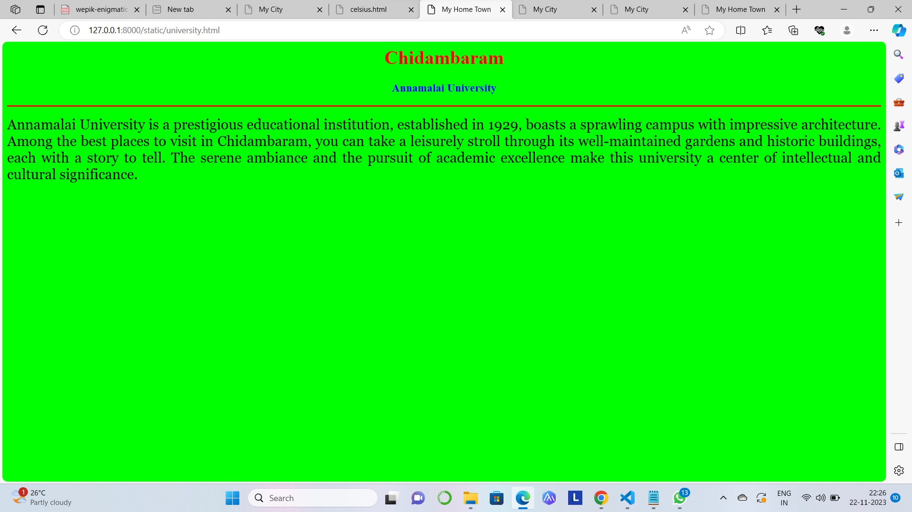

# Ex04 Places Around Me
## Date: 22.11.2023

## AIM
To develop a website to display details about the places around my house.

## DESIGN STEPS

### STEP 1
Create a Django admin interface.

### STEP 2
Download your city map from Google.

### STEP 3
Using ```<map>``` tag name the map.

### STEP 4
Create clickable regions in the image using ```<area>``` tag.

### STEP 5
Write HTML programs for all the regions identified.

### STEP 6
Execute the programs and publish them.

## CODE
```
map.html
<html>
<head>
<title>My City</title>
</head>
<body>
<h1 align="center">
<font color="red"><b>Chidambaram</b></font>
</h1>
<h3 align="center">
<font color="green"><b>AKSHARA C (23013941)</b></font>
</h3>
<center>

<map name="MyCity">
<area shape="rect" coords="400,60,600,110" href="home.html" title="My Home Town">
<area shape="rect" coords="300,220,570,300" href="temple.html" title="Thillai Natarajar Temple">
<area shape="rect" coords="1150,370,1300,420" href="university.html" title="Annamalai University">
<area shape="rect" coords="700,530,880,580" href="resort.html" title="Krish Garden Farm Resort">
<area shape="rect" coords="900,430,1100,480" href="railway.html" title="Railway Station">
</map>
</center>
</body>
</html>

home.html
<html>
<head>
<title>My Home Town</title>
</head>
<body bgcolor="cyan">
<h1 align="center">
<font color="red"><b>Chidambaram</b></font>
</h1>
<h3 align="center">
<font color="blue"><b>Chidambaram - My Home Town</b></font>
</h3>
<hr size="3" color="red">
<p align="justify">
<font face="Georgia" size="5">
Chidambaram is a town and municipality in Cuddalore district in the Indian state of Tamil Nadu, on the banks of the Vellar River where it meets the Bay of Bengal. It is the headquarters of the Chidambaram taluk. The town is believed to be of significant antiquity and has been ruled, at different times, by the Pallavas until ninth century, Medieval Cholas, Later Cholas, Later Pandyas, Vijayanagara Empire, Thanjavur Nayakas, Marathas and the British.The Nataraja temple in Chidambaram is located in the southeastern Indian state of Tamil Nadu.Annamalai University in Annamalainagar, Chidambaram is a top player in the category Educational Institutions in the Chidambaram. Pichavaram, Tamil Nadu's largest mangrove forest, is located on the shores of Chidambaram. The locally famous Silver Beach is situated around 46 kms away from the town of Chidambaram. 
</font>
</p>
</body>
</html>

temple.html
<html>
<head>
<title>My Home Town</title>
</head>
<body bgcolor="yellow">
<h1 align="center">
<font color="red"><b>Chidambaram</b></font>
</h1>
<h3 align="center">
<font color="blue"><b>Thillai Natarajar Temple</b></font>
</h3>
<hr size="3" color="red">
<p align="justify">
<font face="Georgia" size="5">
The Thillai Nataraja Temple is one of the holiest sites for Shiva worshippers and is also one of the grandest and best-preserved temples in India.Chidambaram's main attraction is the Thillai Nataraja Temple. It attracts tourists from all across the country since it is one of the most important places of devotion for Shaivites.
</font>
</p>
</body>
</html>

university.html
<html>
<head>
<title>My Home Town</title>
</head>
<body bgcolor="lime">
<h1 align="center">
<font color="red"><b>Chidambaram</b></font>
</h1>
<h3 align="center">
<font color="blue"><b>Annamalai University</b></font>
</h3>
<hr size="3" color="red">
<p align="justify">
<font face="Georgia" size="5">
Annamalai University is a prestigious educational institution, established in 1929, boasts a sprawling campus with impressive architecture. Among the best places to visit in Chidambaram, you can take a leisurely stroll through its well-maintained gardens and historic buildings, each with a story to tell. The serene ambiance and the pursuit of academic excellence make this university a center of intellectual and cultural significance.
</font>
</p>
</body>
</html>

resort.html
<html>
<head>
<title>My Home Town</title>
</head>
<body bgcolor="purple">
<h1 align="center">
<font color="red"><b>Chidambaram</b></font>
</h1>
<h3 align="center">
<font color="blue"><b>Krish Garden Farm Resort</b>
</font>
</h3>
<hr size="3" color="red">
<p align="justify">
<font face="Georgia" size="5" color="black">
Krish Garden in Chidambaram offers accommodation and a garden.Fitted with a balcony, the units offer air conditioning and feature a flat-screen TV and a private bathroom with shower and free toiletries.A car rental service is available at the farm stay.Mayiladuthurai is 32 km from Krish Garden, while Cuddalore is 41 km away. The nearest airport is Puducherry Airport, 66 km from the accommodation. all our rooms are properly sanitized before the guests check in. all rooms are properly maintained and cleaned. all staffs are professionals in hospitality industry and will serve customers to the best possible. 
</font>
</p>
</body>
</html>

railway.html
<html>
<head>
<title>My Home Town</title>
</head>
<body bgcolor="pink">
<h1 align="center">
<font color="red"><b>Chidambaram</b></font>
</h1>
<h3 align="center">
<font color="blue"><b>Railway Station</b></font>
</h3>
<hr size="3" color="red">
<p align="justify">
<font face="Georgia" size="5">
Chidambaram railway station is a railway station situated in Chidambaram, a municipal town and a taluk headquarters in Cuddalore district, Tamil Nadu, India. The station comes under the Tiruchirappalli railway division of the Southern Railway zone and falls on the main line.
</font>
</p>
</body>
</html>
```

## OUTPUT





## RESULT
The program for implementing image maps using HTML is executed successfully.
